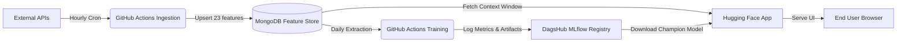

# 🌫️ Pearls AQI Predictor

> **An automated, end-to-end MLOps pipeline and dashboard for real-time Air Quality Intelligence in Karachi.**


**🚀 Live Application:** [https://huggingface.co/spaces/AarishF/pearls-aqi-predictor](https://huggingface.co/spaces/AarishF/pearls-aqi-predictor)

---

## 📖 Overview

Karachi is consistently ranked among the most polluted cities in the world. The **Pearls AQI Predictor** is a production-grade machine learning system designed to monitor real-time air quality in Karachi and generate highly accurate **3-day AQI forecasts**.

The system operates autonomously with zero manual intervention:

1. **Data Ingestion:** Fetches hourly pollutant and meteorological data exclusively from the Open-Meteo APIs.
2. **Feature Engineering:** Computes 43 predictive features including rolling averages, cyclical time encodings, and Open-Meteo 72-hour weather forecasts.
3. **Model Inference:** Passes the engineered features through an ensemble of trained models (XGBoost, Ridge Regression, MLP).
4. **Visualisation:** Serves predictions to the public through an interactive, dark-mode Streamlit dashboard deployed on Hugging Face Spaces.

## 🏗️ System Architecture

The project is built on a decoupled, three-stage MLOps architecture:



### 🧠 Machine Learning Approach

The prediction task is framed as a **multi-output regression** problem. The system evaluates three models across three horizons (Day 1, Day 2, Day 3):

- **XGBoost (Champion):** Chosen for its superior MAE on long-term horizons and robustness to tabular time-series extremes.
- **Ridge Regression:** Serves as the regularised linear baseline.
- **Keras MLP:** A deep-learning network capturing non-linear interactions.
- _All models decisively outperform a naive persistence baseline._

---

## 🛠️ Tech Stack

- **Data Engineering:** `pandas`, `numpy`, `requests`
- **Feature Store:** MongoDB Atlas
- **Model Training:** `xgboost`, `scikit-learn`, `tensorflow-cpu`
- **Experiment Tracking:** DagsHub + MLflow
- **UI & Visualisation:** `streamlit`, `plotly`
- **CI/CD & Automation:** GitHub Actions
- **Deployment:** Hugging Face Spaces (Native Streamlit SDK)

---

## 💻 Local Development

### 1. Clone the Repository

```bash
git clone https://github.com/Aarish-Fr/pearls-aqi-predictor.git
cd pearls-aqi-predictor
```

### 2. Create a Virtual Environment

```bash
python -m venv venv
source venv/bin/activate  # On Windows use: venv\Scripts\activate
```

### 3. Install Dependencies

```bash
pip install -r requirements.txt
```

### 4. Configure Secrets

Create a `.env` file in the root directory and add your credentials:

```env
# MongoDB Atlas
MONGO_URI="mongodb+srv://<user>:<password>@cluster..."

# DagsHub / MLflow
DAGSHUB_USERNAME="<your-username>"
DAGSHUB_TOKEN="<your-token>"

# APIs (For feature ingestion)
OPEN_METEO_URL="https://api.open-meteo.com/v1/forecast"
```

### 5. Run the Application Locally

```bash
streamlit run app/dashboard.py
```

The app will automatically download the champion XGBoost model from MLflow, fetch the latest context window from MongoDB, and serve the dashboard at `http://localhost:8501`.

---

## 🔄 Automated CI/CD

This repository contains two GitHub Actions workflows located in `.github/workflows/`:

- `feature_pipeline.yml`: Runs **hourly**. Fetches new API readings, engineers base features, and upserts them into MongoDB.
- `training_pipeline.yml`: Runs **daily**. Downloads the full historical dataset, trains all three models, and registers the winning artifacts to MLflow.

---

## 🏆 Project Delivery

This system was engineered and deployed from scratch as part of the **10Pearls Internship Programme (June 2026)**.

**🚀 View the Live Dashboard:** [Pearls AQI Predictor](https://huggingface.co/spaces/AarishF/pearls-aqi-predictor)
